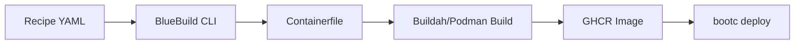
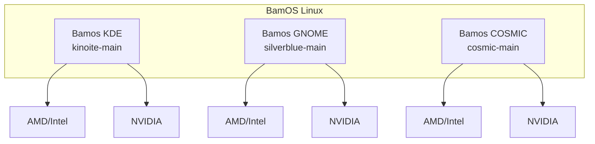

# BamOS — Development Guide

## Architecture Overview

BamOS is built on **BlueBuild**, a toolchain that generates Containerfiles from YAML recipes. It produces Fedora Atomic OCI images that can be deployed via `bootc`.

### Build Pipeline



### Editions

BamOS ships 6 editions — 3 Desktop Environments × 2 GPU stacks:



## Development Setup

### Prerequisites

```bash
# Install BlueBuild CLI
sudo dnf copr enable xyny/bluebuild
sudo dnf install bluebuild

# Or use podman directly
sudo dnf install podman podman-docker
```

### Build Locally

```bash
# Build a specific edition
sudo bluebuild build recipes/bamos-kde.yml

# Build all editions
for recipe in recipes/bamos-*.yml; do
    sudo bluebuild build "$recipe"
done
```

### Test Image

```bash
# Run a container from the built image
podman run --rm -it ghcr.io/quocnho/bamos-kde:latest

# Or rebase on an existing Fedora Atomic system
sudo bootc switch ghcr.io/quocnho/bamos-kde:latest
sudo systemctl reboot
```

## Recipe Structure

Each recipe YAML uses BlueBuild modules:

```yaml
# recipe.yml
name: bamos-kde
description: BamOS KDE Plasma Edition
base-image: ghcr.io/ublue-os/kinoite-main
image-version: 44

modules:
  - type: files
    files:
      - source: system
        destination: /
  
  - type: script
    scripts:
      - 00-build-setup.sh
  
  - type: dnf
    install:
      packages:
        - package-name
  
  - type: default-flatpaks
    configurations:
      - scope: system
        install:
          - org.mozilla.firefox
  
  - type: signing
```

## CI/CD

GitHub Actions builds all 6 editions via matrix strategy:

- **Trigger**: Push to main, daily schedule (06:00 UTC), manual dispatch
- **Parallel**: 2 concurrent builds to avoid runner storage limits
- **Signing**: Cosign with SIGNING_SECRET
- **Output**: `ghcr.io/quocnho/bamos-*` with `latest` and `YYYYMMDD` tags

## Adding New Packages

1. **Common packages**: Add to `files/scripts/00-build-setup.sh`
2. **DE-specific packages**: Add to `files/scripts/01-install-packages.sh`
3. **Quick addition**: Add `type: dnf` module to the recipe YAML

## Adding New System Files

1. **Shared across all editions**: `files/system/<path>`
2. **KDE-specific**: `files/kde-system/<path>`
3. **GNOME-specific**: `files/gnome-system/<path>`
4. **COSMIC-specific**: `files/cosmic-system/<path>`

## References

- [BlueBuild Docs](https://blue-build.org/)
- [Fedora Atomic Docs](https://docs.fedoraproject.org/en-US/fedora-atomic/)
- [RakuOS](https://rakuos.org/) — Design inspiration
- [ublue-os/main](https://github.com/ublue-os/main) — Base images
